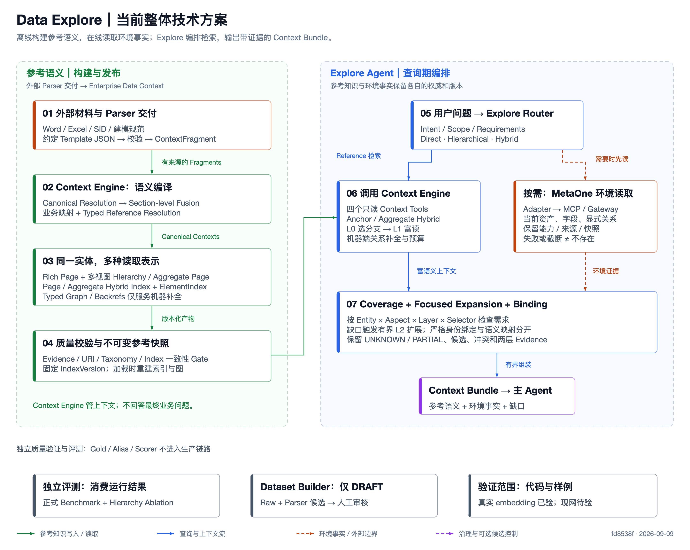

# Data Explore 当前整体方案

核对基线：`fd8538fbe911560ac8250b59d4a47d969f8d6d23`，日期：2026-09-09。

当前系统是一套**先构建可追溯的参考语义，再按问题检索、检查缺口并绑定环境事实的上下文系统**。它包含两个逻辑模块：Enterprise Data Context 负责上下文编译、组织、发布与只读检索；Explore Agent 负责查询期编排，返回 Context Bundle。主 Agent 或业务应用消费 Bundle，继续完成分析、SQL 或建模任务。

## 图与阅读顺序

- [离线交互方案图](data-explore-v1.1-architecture.html)：总览、构建、查询、变化与验证边界；点击节点可查看源码依据，可缩放及下载。
- [整体总览 PNG](data-explore-v1.1-overview.png) / [可编辑 SVG](data-explore-v1.1-overview.svg)
- [构建与发布 PNG](data-explore-v1.1-build.png) / [SVG](data-explore-v1.1-build.svg)
- [查询与绑定 PNG](data-explore-v1.1-runtime.png) / [SVG](data-explore-v1.1-runtime.svg)

## 1. 两个模块，两个知识平面

| 部分 | 职责 | 权威与限制 |
|---|---|---|
| Enterprise Data Context | 校验交付，构建 Canonical、Pages、Hierarchy、索引与机器图；发布固定版本；提供四工具 | 是 Context Engine，不是回答 Agent |
| Explore Agent | 意图路由、检索、需求覆盖检查、局部展开、环境绑定和 Bundle 组装 | 只读；不生成最终 SQL 或模型，不进行逐节点 LLM 图遍历 |
| Reference 知识 | 场景、分析目的、业务对象、指标、维度、参考模型、SID/建模语义 | 来源可不完整；不能证明资产在当前环境存在 |
| Environment 知识 | 当前环境资产、字段、显式关系、可用性及环境版本 | 经 Adapter 从 MetaOne 读取；能力不足、超时、截断不等于不存在 |

两个知识平面不做全局合库。一次查询创建临时 Binding Overlay，保留各自来源和版本。Environment-first 表示在需要环境事实时先解析环境证据，不表示每个问题都必须调用 MetaOne，也不禁止后续参考语义补充。

依据：[compiler.py](../../enterprise_data_context/compiler.py)、[agent.py](../../explore_agent/agent.py)、[environment.py](../../enterprise_data_context/environment.py)、[双层知识规范](../../specs/15-dual-layer-knowledge.md)。

## 2. 构建期：从交付材料到可发布的参考语义

主交付入口是外部 Parser 产出的五类约定 Template JSON。消费端先校验 schema、shape、来源和交付范围，转成内部 `ContextFragment`。仓库仍保留 `compile`、`compile_documents`、`compile_fragments` 兼容入口，不能将它们误画成正式 Parser 团队必须交付的格式。

编译主链依次完成：

1. **Canonical Resolution**：判定 Fragment 对应哪个实体，维护唯一身份。
2. **Section-level Fusion**：针对 section 按来源权威和状态融合，保留冲突，不能盲目整对象覆盖。
3. **Business Mapping / Classification**：连接物理模型/字段与业务对象/属性/主题，并规范分类。
4. **Typed Reference Resolution**：解析前向引用，无法确认的目标保持未解或候选状态。
5. **组织与物化**：从 Canonical 构建 Rich Pages、Hierarchy/Aggregate、索引、Graph 与 Backrefs。
6. **Quality Gate / Snapshot**：检查证据、路径、引用、环、适用视图及索引一致性，再发布不可变版本。

SID 与建模规范是受治理语义参考，不是主 Context 层级。原始 Word/Excel 结构解析应确定性完成；Code Agent 不承担每份文档的运行时解析工作。

依据：[delivery.py](../../enterprise_data_context/delivery.py)、[compiler.py](../../enterprise_data_context/compiler.py)、[CanonicalResolver](../../enterprise_data_context/canonical/resolver.py)、[MergeEngine](../../enterprise_data_context/fusion/merge.py)、[业务映射](../../enterprise_data_context/mapping/business.py)。

## 3. 一份 Canonical，三类表示

| 表示 | 面向谁 | 用途 |
|---|---|---|
| Rich Context Page | LLM / 上下文消费者 | 实体的 L0 摘要、L1 富语义和聚焦 L2 细节 |
| Hierarchy + Aggregate Page | 分支检索和富读 | 按 Analysis / Domain / Asset 组织同一实体，汇总有证据的成员 |
| Typed Graph + Backrefs + ElementIndex | 服务内部机器逻辑 | 关系补全、血缘/影响、反向引用以及字段/Counter 等局部展开 |

Hierarchy 的 `organized_under` 是组织关系，不会进入事实 Graph。Canonical URI（如 `data://topics/...`）和 Aggregate URI（`data://views/{view}/{kind}/{slug}`）严格分离。聚合页保留 `canonical_ref`、`member_refs`、`child_branches`；读哪个 URI 就得到对应类型的 Page。

V1.1 的层级组织规则是：

- 显式 `taxonomy_nodes/taxonomy_edges` 带 Evidence 独立构建，不需要实例同时携带多个标签。
- Explicit Taxonomy 优先；其余同槽按 CONFIRMED、DERIVED、CANDIDATE 区分，冲突保留。
- 分类只计算实体的 applicable views；例如 Metric 的 Analysis placement 已足以完成分类。
- CANDIDATE 不参与强导航、硬筛选或正式分类完成度，也不自动提升成 Canonical 事实。
- L0/L1 为有界概要；全量成员、组织关系、Evidence 和审计放在 L2。

依据：[HierarchyIndex](../../enterprise_data_context/indexes/hierarchy.py)、[Aggregate 物化](../../enterprise_data_context/materialization/aggregate_pages.py)、[层级契约](../../specs/semantic-hierarchy.md)、[披露规范](../../specs/progressive-disclosure.md)。

## 4. 查询期：按问题选择入口，而非统一从根浏览

QueryRouter 产出 intent、scope、entities、aspects 和固定 `retrieval_strategy`；集中策略决定 mode、hierarchy_views、primary_view、confidence、reasons。服务端以真实 Page/Element exact match 校准临时锚点判断。

| 问题 | 路径 | 行为 |
|---|---|---|
| RSRP 有哪些模型？ | Direct | 精确实体/元素锚点 + 既有 Entity Hybrid Search |
| 地铁弱覆盖需要哪些数据？ | Hierarchical / Analysis | 先限定视图，再找到相关 Aggregate 分支和成员 |
| ODS 层有哪些无线模型？ | Hierarchical / Asset | 明确层级 scope 驱动资产视图 |
| RSRP 用于弱覆盖还需要哪些数据？ | Hybrid | Direct Anchor 与相关语义分支合并 |

AggregatePageIndex 为每个视图包装现有 PageIndex，复用 Exact/Alias、BM25、Dense、Facet、RRF。只索引 branch 元数据和 L0/L1 概要，不嵌入 L2 全量成员。默认最多两个 View、合计三个分支；Candidate-only 分支排除。Dense 不可用会显式报告并保留 lexical 回退。

一次 `data_search` 内部完成分支选择、L1 富读、成员锚点发现、TypedReference/Backref 补全、排序、多样性和 hydration 预算控制。四工具仍为 `data_search/data_read/data_expand/data_source`；没有新增 `next_node` 或逐节点 Graph Tool。MCP/HTTP 是传输适配，不是业务层级或额外 Agent。

依据：[集中路由策略](../../enterprise_data_context/retrieval_strategy.py)、[AggregatePageIndex](../../enterprise_data_context/indexes/aggregate.py)、[hierarchical_retrieval.py](../../enterprise_data_context/hierarchical_retrieval.py)、[ContextRetrievalService](../../enterprise_data_context/retrieval.py)、[四工具](../../enterprise_data_context/tools.py)。

## 5. Coverage 与 Binding 保证什么

Coverage 以 **Entity × Aspect × Layer × Selector** 为单位检查可见证据。Model A 有字段不代表 Model B 的字段需求已满足；Reference 语义不能代替 Environment 要求；指定字段的 selector 不能被任意字段的存在所满足。

结果包括 SATISFIED、PARTIAL、UNKNOWN、MISSING、NOT_APPLICABLE。MISSING 必须有完整、权威、特定范围的缺失证据；NOT_APPLICABLE 同样需要明确证据。空搜索、部分材料、接口不支持或超时应保留 UNKNOWN/PARTIAL 等实际状态。

Explore 先评估 Coverage，再针对缺口做至多一次批量 focused expansion，重新评估后返回结果。当前每轮是有界流程，不是无限迭代直到“看似覆盖完整”。未满足的内容保留在 `missing_context`、`stop_reason` 和 trace 中；resume 固定 query/requirements、IndexVersion 和 serving version。

Binding Overlay 分开 IdentityBinding、SemanticMapping、StructuralRelation。Identity 只接受同类型、当前环境/快照 Evidence 下的显式 provider crosswalk，或 namespace/environment 一致的稳定 ID/完整强键。名称、别名和相似度不能确认身份。Reference-only 不等于已部署；只有权威确认环境缺失时才允许相应参考替代候选。

依据：[Coverage](../../explore_agent/coverage.py)、[Explore 编排](../../explore_agent/agent.py)、[Binding](../../explore_agent/binding.py)、[Overlay schema](../../contracts/binding-overlay.schema.json)。注意：代码中的版本维度独立，Coverage serving 标识为 `requirement-coverage/v3`，身份规则含 `/v3`，环境 adapter 的 policy 常量仍为 `environment-binding/v2`；不把这些标签误当成统一发布版本。

## 6. LLM 的角色与输出边界

核心显式编译、融合和物化是确定性的。可选语义能力包括：离线有界 Evidence Pack 的候选关系推断、Hierarchy 的规则/邻居/可选 LLM placement，以及查询期 bounded router 和 JointReasoner。离线候选报告保留来源、目标、规则/模型和版本，不能直接变成已确认事实。

JointReasoner 的当前实现主要选择、比较可核对的证据原文片段，不是自由生成最终事实；不能修改 Coverage 或确认身份。Dense 用于查询召回，本轮没有逐实体 Dense Taxonomy Classification。

依据：[候选推断 pipeline](../../enterprise_data_context/inference/pipeline.py)、[Hierarchy inference](../../enterprise_data_context/hierarchy_inference.py)、[Bounded runtime](../../explore_agent/bounded.py)、[Reasoner](../../explore_agent/reasoner.py)。

## 7. 版本发布、增量与评测隔离

不可变参考快照保存 Canonical、Rich Pages、Hierarchy 贡献、Aggregate、配置、指纹与 manifest，原子切换 `latest.json`。加载时重建可丢弃的 Page/Element/Graph 等读取结构。

增量保证主要作用于组织贡献、受影响分支/祖先和相关 Aggregate 索引。Taxonomy 边、label/alias、实体内容变化按依赖失效；routing 版本改变不重跑分类。不据此宣称整个 Parser 或 Canonical Fusion 已实现全量增量编译。

Evaluation 是独立消费者。Dataset Builder 从 Raw/Parser 信息发现候选，只产 DRAFT Case/Alias/Review Queue；Parser 不是 Gold Oracle，人工审核与 scorer 侧冻结独立进行。Gold/Alias/评分器不能进入生产 Context、Hierarchy 配置、检索索引或模型输入。正式四方案 Benchmark 与五组 Hierarchy ablation 分开。

依据：[Persistence](../../enterprise_data_context/persistence.py)、[Dataset Builder](../../evaluation/dataset_builder/README.md)、[内部适配指南](../../INTERNAL_ADAPTATION_GUIDE.md)、[Hierarchy ablation](../../evaluation/hierarchy/run.py)。

## 8. 当前已经验证到哪里

V1.1 实施记录有 227 项 Python 测试通过；Template 样例为 792 fragments、110 Context/Page，来源 PARTIAL，339 个 unresolved references 明确保留。无变更重建保持版本一致且不重跑组织推断。

本机真实多语言 MiniLM 已在 synthetic corpus 验证两个非词面问题首位命中；九条查询的消融中，启用 Hierarchy 的 mode/view accuracy 均为 1.0。宽泛 Recall/F1 有提升，但 Precision 与完整交付 token 没有证明同步改善，不能声称全面成本优势。

MetaOne Gateway/Adapter 机制及 fixture 已实现，真实原始 payload 映射、认证、分页和 operational limits 仍需内部环境校准。真实企业材料、规范审核、查询分布、多义分支 Precision、规模性能与 LLM 路由准确率也仍待验证。

依据：[V1.1 实施报告](../../SEMANTIC_HIERARCHY_V1_1_IMPLEMENTATION.md)、[真实 embedding 消融](../../evaluation/hierarchy/results/v1.1/trained/sample-ablation.json)、[MetaOne README](../../mcp/data-catalog/README.md)。本次绘图未重跑后端测试，以上为已提交基线的验证记录。

## 9. 图的维护与视觉验证

旧图不覆盖；新图的可复现来源是 [生成器](../../scripts/render_current_architecture.py) 和 [离线 HTML 模板](../../scripts/current_architecture_template.html)。运行 `python3 scripts/render_current_architecture.py` 生成 SVG/HTML；[检查脚本](../../scripts/check_current_architecture.cjs) 使用本机 Chrome + Playwright 验证交互、文字边界、离线网络请求和 SVG/PNG 下载，并导出 PNG。

图形验证记录另见 [validation.json](data-explore-v1.1-validation.json)。自动几何检查和图片视觉复核是不同步骤；只有实际查看导出的 PNG 后才记录 visual_review: passed。
